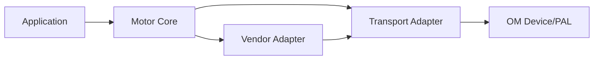

# ADR-0002 电机统一模型顶层设计

## 背景 (Context)
- 当前仓库并行存在多个厂商电机驱动（如 DJI、P1010B），协议模型差异大。
- 上层业务若直接依赖 vendor 协议，接口将持续分叉并放大维护成本。
- 需要在不破坏现有驱动可用性的前提下，引入统一语义模型。

## 考虑过的方案 (Options)
- 方案 A：保持 vendor 直连，上层按厂商分支处理。
- 方案 B：一次性重写为全新统一框架并废弃旧接口。
- 方案 C：引入 `MotorCore + VendorAdapter + TransportAdapter`，旧接口渐进映射。

## 最终决策 (Decision)
- 采用方案 C。
- 定义 `MotorBus` 为控制域逻辑对象，不等价于物理端口。
- 统一层只暴露语义合同与能力声明，vendor 协议细节封装在适配层。
- 保留既有 vendor 外观接口（如 `dji_*`、`p1010b_*`），内部逐步映射统一模型。

## 影响 (Consequences)
- 新增 vendor 必须先声明能力，再实现协议映射，不得向业务层泄漏私有协议。
- 故障动作、状态机、调度语义由 `MotorCore` 统一主导。
- 文档分层固定：决策放 [`docs/adr`](../adr)，API/参考手册保留代码邻近目录。
