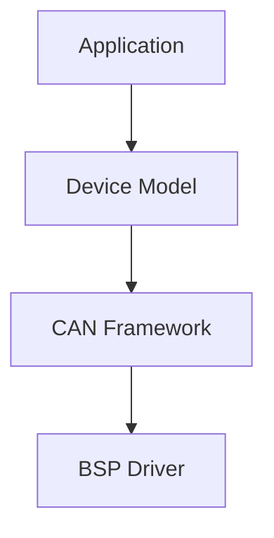

# ADR-0005 CAN 组织架构分层

## 背景 (Context)
- CAN 相关逻辑跨越 BSP、框架、设备模型、应用层。
- 若应用直接依赖板级细节，将导致跨平台不可迁移和接口不稳定。

## 考虑过的方案 (Options)
- 方案 A：应用直接调用 BSP 入口。
- 方案 B：`Device Model -> CAN Framework -> BSP` 分层，应用仅走设备接口。
- 方案 C：按板级项目自由封装，不统一。

## 最终决策 (Decision)
- 采用方案 B。
- 应用层只通过 `Device API` 使用 CAN。
- `CAN Framework` 负责过滤器资源管理、软队列与接收分发。
- `BSP` 只暴露硬件能力与收发控制，不向应用泄漏板级实现细节。

## 影响 (Consequences)
- 过滤器句柄、路由语义、错误统计成为框架稳定合同的一部分。
- 板级差异收敛在 BSP，应用与上层服务接口保持稳定。
- 中断路径需坚持“最小化入队”，复杂路由与发布在线程上下文完成。
