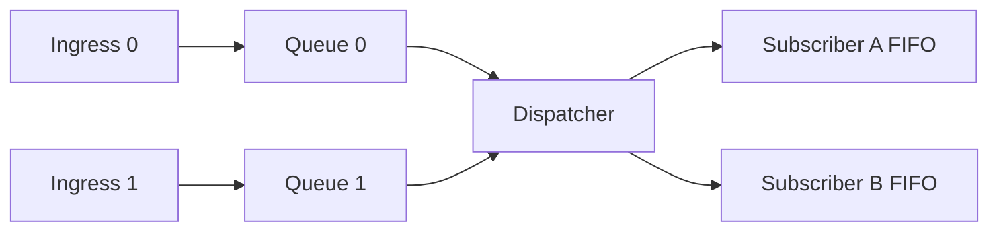

# ADR-0006 CAN 接收路径建模选型

## 背景 (Context)
- 目标是在高负载下保证接收路径可预测、可观测，并保持跨板卡可迁移。
- 接收路径需要同时满足 ISR 有界时延、可扩展 ingress、同订阅 FIFO 语义。

## 考虑过的方案 (Options)
- 方案 A：单共享队列 MPSC。
- 方案 B：N 路 SPSC ingress 队列 + 单 dispatcher + 每订阅独立 FIFO。
- 方案 C：依赖同优先级配置的伪单生产者。

## 最终决策 (Decision)
- 采用方案 B 作为框架基线。
- 每个 ingress 独立写入各自 SPSC 队列，dispatcher 统一做路由与发布。
- 保证同一订阅内 FIFO；默认不承诺跨 ingress 全局 FIFO。

## 影响 (Consequences)
- ISR 路径争用显著降低，时延更稳定。
- 观测维度提升：可按 ingress 统计积压、丢包、抖动。
- 禁止将“同优先级配置”作为正确性前提。
