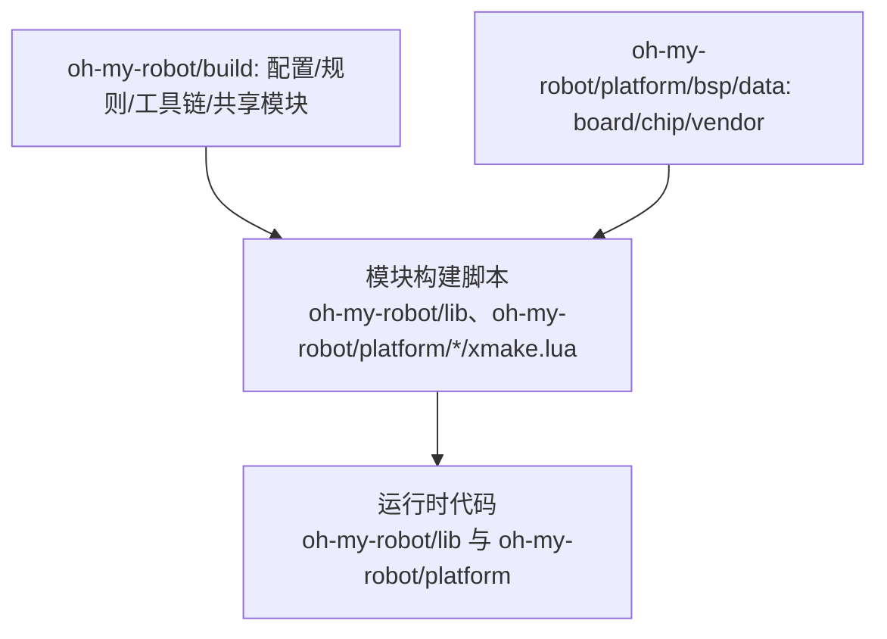
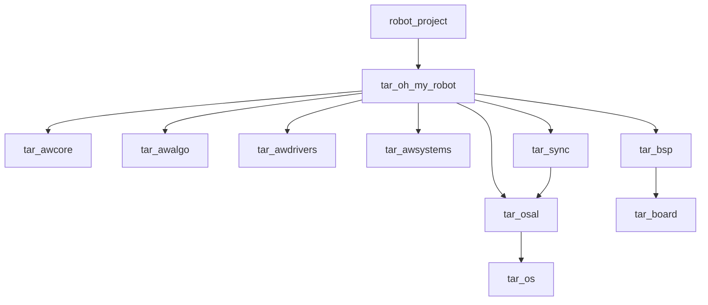
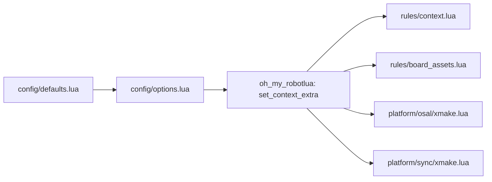
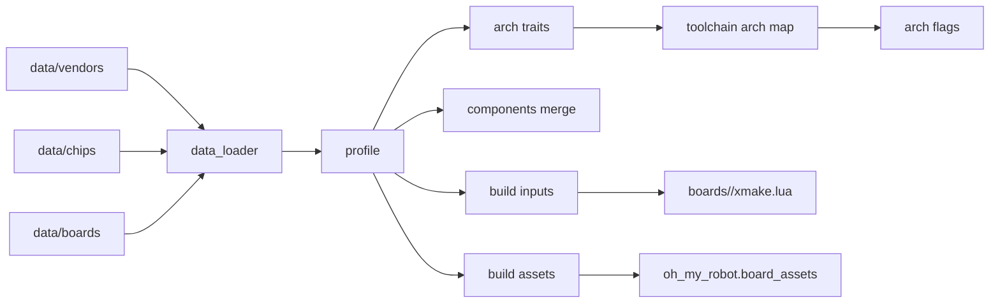

# OM XMake 维护者手册

## 1. 目标与维护边界
本手册面向维护者，目标是说明 OM 构建体系的模块边界、依赖关系、数据流与扩展方式。文档内容完全基于当前仓库实现。

相关文档索引：
- `oh-my-robot/document/build/BuildTasksManual.md`：内置任务与参数说明。
- `oh-my-robot/document/build/BuildSystemBestPractices.md`：构建系统最佳工程实践。
- `oh-my-robot/document/build/upstream_xmake_armlink_sourcefile_nil.md`：XMake `armlink.lua` 缺陷的上游提交材料（复现、根因、建议 patch）。

## 2. 构建系统设计方法论
- **分层原则**：构建系统只在 `oh-my-robot/build/` 集中管理“选项、规则、工具链、共享模块”，模块级构建脚本就地维护，避免全局脚本侵入模块。
- **单一入口**：顶层 `xmake.lua` 仅负责入口转发与目标聚合，不直接承载工具链或板级逻辑。
- **数据/行为分离**：板级/芯片/厂商数据放在 `oh-my-robot/platform/bsp/data`，构建规则与工具链行为放在 `oh-my-robot/build`。
- **依赖方向**：模块构建脚本可以调用构建层 API（如 `oh-my-robot`、`bsp`），构建层不得硬编码模块路径或板级细节。
- **口径边界**：构建期依赖用于约束“可见与可链接”关系，不等同于运行时调用链；运行时依赖需结合接口调用/注册路径单独审计。
- **上移准则**：当逻辑被多个模块复用、与具体板级无关、且不依赖运行时代码时，才上移到 `oh-my-robot/build`；否则保持模块内聚。
- **脚本域约束**：仅在脚本域使用 `import/try/raise/task.run` 等 API，描述域只做目标/规则/选项声明，避免配置期卡死或无效调用。

## 3. 构建链路全景（从配置到产物）
1) 配置阶段：`xmake f` 读取 `board/os/toolchain/sync_accel/semihosting` 等选项。  
2) 选项回调：`oh-my-robot/build/config/options.lua` 在 `after_check` 中写入上下文。  
3) 上下文持久化：`oh-my-robot/build/modules/oh_my_robotlua` 将关键字段保存到配置缓存。  
4) 编译数据库：通过 `plugin.compile_commands.autoupdate` 在构建后生成 `compile_commands.json` 至项目根目录。  
5) 目标加载：`oh_my_robot.context` 注入架构与工具链参数。  
6) 板级资源：`oh_my_robot.board_assets` 注入启动文件与链接脚本。  
7) 可选镜像：`oh_my_robotimage_convert` 生成 `hex/bin` 并在清理时移除。  
8) 编译与链接：`tar_board`、`tar_os`、`tar_sync` 等目标完成编译，最终由 `robot_project` 输出可执行镜像。  

## 4. 构建入口与目录职责
- `xmake.lua`：顶层入口，定义 `robot_project` 并挂载规则；设置官方 LTO 策略默认关闭，由 `oh_my_robot.context` 按工具链动态启用（debug/release 同口径）。
- `oh-my-robot/xmake.lua`：OM 构建入口转发（实际入口在 `oh-my-robot/build/xmake.lua`）。
- `oh-my-robot/build/xmake.lua`：OM 构建入口，加载配置/规则/子模块，并定义聚合目标 `tar_oh_my_robot`。

核心目录职责：
- `oh-my-robot/build/config/`：构建选项与默认值。
- `oh-my-robot/build/rules/`：规则定义（上下文注入、板级资源、镜像转换）。
- `oh-my-robot/build/toolchains/`：工具链数据与脚本逻辑。
- `oh-my-robot/build/tasks/`：自定义任务（如 flash 烧录）。
- `oh-my-robot/platform/bsp/`：BSP 数据加载、合并、板级构建脚本。
- `oh-my-robot/platform/osal/`：OS 抽象层与 OS 端口。
- `oh-my-robot/platform/sync/`：同步原语与可选加速后端。
自定义任务：
- `xmake flash`：通过 J-Link Commander 烧录，默认优先使用 HEX，可通过 `--firmware` 指定 ELF/HEX，并可通过 `--native_output=true` 透传原生输出。
- 调试器支持矩阵（当前）：`om_preset.flash` 仅接入 `jlink`；`daplink` 尚未实现，仅作为规划项记录。


## 5. 目录职责与依赖方向简图
**依赖方向原则**
- 构建系统层（`oh-my-robot/build`）提供配置、规则、工具链与共享 API，供模块构建脚本调用。
- 模块构建脚本（`oh-my-robot/lib`、`oh-my-robot/platform` 下的 `xmake.lua`）只描述本模块目标与依赖，不反向依赖构建系统实现细节。
- 板级/芯片/厂商数据（`oh-my-robot/platform/bsp/data`）仅被 BSP 装配层读取，不直接参与构建规则。



## 6. 目标依赖关系图


## 7. 模块关系与数据流
### 7.1 配置与上下文流向


### 7.2 BSP 数据装配关系


## 8. 模块职责细节
### 8.1 配置模块
- `oh-my-robot/build/config/defaults.lua`：定义 `board/os/sync_accel/semihosting` 默认值。
- `oh-my-robot/build/config/options.lua`：
  - 基于 `oh-my-robot/platform/bsp/data/boards/index.lua` 与 `oh-my-robot/platform/osal/index.lua` 枚举可选 board/os。
  - 将 board/os/toolchain/arch/flags 写入上下文。
  - `semihosting=off` 时为 armclang 可执行目标注入非 semihosting syscall 覆盖桩，避免运行期触发 semihost BKPT。
  - 对默认值进行合法性校验。
  - `config.arch` 作为平台架构标识：优先取工具链数据中的 `arch`，缺失时使用板级 CPU 架构。
    - `context.arch` 表示 CPU 架构（来自 BSP 芯片数据），芯片仅提供 `arch_traits`，由工具链映射生成 `arch_flags`。

### 8.2 规则模块
- `oh_my_robot.context`：
  - 注入 `arch_flags` 与 `toolchain_flags`。
  - 当 LTO 计划开启时，按工具链收敛注入显式参数（`gnu-rm`: `-flto`；`armclang`: `-flto/--lto`），确保参数落地一致。
  - 配置阶段校验硬浮点支持，并确保工具链已完成检测。
  - 构建后输出 `build mode` 与 `memory distribution`：
    - `build mode` 通过目标模式接口判定（`debug`/`release`）。
    - `memory distribution` 输出 `FLASH/RAM` 的 `used/total/percent`（优先解析 ELF 用量与链接脚本容量）。
  - 构建后执行链接契约校验（`tar_os`/`tar_sync` 关键强符号检查），失败即终止构建。
- `oh_my_robot.board_assets`：
  - 注入启动文件与链接脚本。
  - 依赖 `toolchain_linker_flag`。
- `oh_my_robotimage_convert`：
  - 构建后生成 `hex/bin`。
  - 清理阶段删除生成文件。

### 8.3 工具链模块
- `oh-my-robot/build/toolchains/data.lua`：工具链数据（`toolset/image/linker_flag` 等）。
- `oh-my-robot/build/toolchains/xmake.lua`：注册 `kind=custom` 工具链。
- `oh-my-robot/build/modules/toolchain_lib.lua`：脚本侧 API，供规则与配置使用。
- `oh-my-robot/build/toolchains/toolchain_bootstrap.lua`：在构建前补全工具链配置，保证首轮构建可用。

### 8.4 BSP 模块
- `bsp/data_loader.lua`：加载 board/chip/vendor 数据并生成 profile。
- `bsp/arch.lua`：解析架构与 arch traits。
- `bsp/components.lua`：合并组件数据（board 覆盖优先）。
- `bsp/inputs.lua`：输出 `defines/includedirs/sources/headerfiles/extrafiles`。
- `bsp/assets.lua`：解析启动文件/链接脚本与板级 OS 配置目录。
- rm-c-board 的 armclang scatter 不再将 FreeRTOS 相关对象固定放入 `RW_IRAM2`，避免 CCM/DMA 风险。

### 8.5 armclang 运行时与 semihosting 维护约束
- 运行时决策入口：`oh-my-robot/build/toolchains/toolchain_runtime.lua`。
  - `resolve_semihosting_mode()` 只接受 `off/on`。
  - `resolve_runtime_payload("armclang", "off")` 返回 `oh-my-robot/build/runtime/armclang/semihost_stub.c`。
  - `resolve_runtime_payload("armclang", "on")` 返回空注入。
- 注入生效点：`oh-my-robot/build/rules/context.lua` 的 `oh_my_robot.context` 规则。
  - 仅对 `target:kind() == "binary"` 注入运行时 payload。
  - 静态库目标不应注入 semihost stub，避免污染库边界。
- stub 语义约束（`oh-my-robot/build/runtime/armclang/semihost_stub.c`）：
  - 目标是“去 semihost 依赖”，不是“模拟完整主机文件系统”。
  - `_sys_open` 返回伪句柄用于保障 C 运行库初始化继续执行。
  - `_sys_exit` 保持死循环，避免落入未定义宿主行为。
- 维护原则：
  - 修改 stub 返回值前，必须评估对启动阶段、日志路径与异常路径的影响。
  - 不要在业务代码中直接依赖 semihosting 行为；semihosting 仅视为调试能力。

### 8.6 Cortex-Debug 下载策略约束
- 推荐策略：`.elf` 作为符号载体，`.hex` 作为下载载体（`restore xxx.hex`）。
- `gnu-rm` 可使用 `load`；`armclang` 在部分调试链路下使用 `load` 可能出现段装载语义不一致，应优先 `restore .hex`。
- 禁止将 `restore xxx.bin binary` 作为通用模板默认值：该命令缺省从 `0x00000000` 写入，强依赖目标地址别名，不具备稳定迁移性。

### 8.7 weak/strong 覆盖链接治理约束
根因定义：
- 问题属于“静态库成员抽取机制”范畴，不是 `weak` 语法错误。
- 当 `weak` 符号已满足未定义引用时，链接器不会继续抽取库内同名 `strong` 成员。
- 仅调整库顺序通常无法根治该类问题。

当前实现（必须保持）：
- `platform/bsp/inputs.lua` 负责收集 `override_sources`（vendor/chip/board）并从 `inputs.sources` 中排除。
- `build/rules/board_assets.lua` 仅对 `binary` 目标注入 `override_sources`，并带入板级 `includedirs/defines`。
- 覆盖源通过“直连最终 `binary`”参与链接，不依赖静态库抽取偶然性。

维护约束：
- 新增必须覆盖 `weak` 的点时，必须将 `strong` 源文件登记到对应层级 `override_sources`。
- 不得默认依赖 `whole-archive` 作为跨工具链通用方案。
- 不得将“应用层 weak 扩展”作为推荐模式对外传播；当前版本明确不建议应用层使用 weak 语义承载业务逻辑。
- 中断/启动/端口钩子等关键覆盖点，必须在构建验证阶段执行符号强弱校验。

未来规划（路线要求）：
1. XMake 层：
   - 建立不局限于单一层级的通用强制覆盖规则，统一管理 BSP/OSAL/SYNC/APP 等覆盖源。
2. 用户层：
   - 推进无感开发能力，目标是强定义位置不受文件层级与组织方式约束，仍可稳定正确链接。

### 8.8 OSAL/SYNC 聚合边界与链接契约约束
当前实现（必须保持）：
- `tar_oh_my_robot` 与 `tar_osal` 使用聚合目标（`phony`），不直接产出静态库。
- 应用目标只依赖 `tar_oh_my_robot`，禁止直连 `tar_os`、`tar_sync`。
- `tar_osal -> tar_os` 采用 `public` 依赖传播，确保链路闭包稳定。

维护约束：
- 不得把“应用层直接补 `add_deps("tar_os")`/`add_deps("tar_sync")`”作为修复手段。
- 若出现 OSAL/SYNC 未定义引用，应优先检查聚合层依赖传播与底层模块产物完整性。
- 任何新增 OSAL/SYNC 核心符号都应同步纳入链接契约校验列表。

### 8.9 armclang 链路确定性与诊断约束
当前实现（必须保持）：
- `oh-my-robot/build/toolchains/toolchain_overrides.lua` 对 `armclang` 强制补全 `toolset_as=armclang`，禁止回退到 `armasm`。
- 若用户显式传入 `toolset_as` 且值不是 `armclang`，配置期直接报错，不做隐式兼容。

版本门禁（配置期/构建期）：
- XMake 最低版本：由工程根 `xmake.lua` 的 `set_xmakever("3.0.7")` 统一约束。
- armclang 最低版本：`6.14`（通过 `armclang --version` 解析并强校验）。
- 任一版本不满足门禁时，必须直接失败，不允许降级继续构建。
- 授权前提（配置期基线）：
  - armclang 链路要求 `armlink` 具备非 Lite 授权能力。
  - 维护者在发布/分发前必须执行 `armlink --vsn`，若 `Product` 含 `MDK-ARM Lite`，需标记为不满足 armclang 发布前提。

## 9. 数据结构与合并策略
### 9.1 Toolchain 数据
- 定义位置：`oh-my-robot/build/toolchains/data.lua`。
- 关键字段：`default/toolchains`。
- `toolchains[name]` 包含 `kind/plat/arch/linker_flag/toolset/image`。
- `linker_accepts_arch_flags`：控制是否将工具链映射得到的 arch ldflags 注入链接阶段（armclang 为 `false`）。
- 对 `gnu-rm/armclang`，`sdk/bin` 需由 CLI 或 `toolchain_presets` 提供。

### 9.2 BSP 三层数据
- vendor：`oh-my-robot/platform/bsp/data/vendors/<vendor>.lua`
- chip：`oh-my-robot/platform/bsp/data/chips/<chip>.lua`
- board：`oh-my-robot/platform/bsp/data/boards/<board>.lua`
- chip 使用 `arch_traits` 描述 CPU/FPU/float-abi 等架构数据。

### 9.3 组件合并规则
- 字段统一：`defines/includedirs/sources/headerfiles/extrafiles`。
- 合并优先级：board 覆盖优先，其次 chip，再其次 vendor。
- `component_overrides` 允许对单组件进行白名单覆盖。

## 10. 上下文与持久化
- 上下文字段：`board_name/chip_name/os_name/toolchain_name/arch/arch_flags/toolchain_flags/board_os_config_dir`。
- `oh-my-robot/build/modules/oh_my_robotlua` 将上下文保存到 `om_ctx_*` 配置项。
- `get_context()` 缺失字段时会提示先执行 `xmake f`。

## 11. 扩展指南（模板）
### 11.1 新增 vendor（示例）
文件：`oh-my-robot/platform/bsp/data/vendors/my-vendor.lua`
```lua
local vendor = {
  name = "MY_VENDOR",
  defines = {},
  includedirs = {},
  components = {
    cmsis = {
      includedirs = {"vendor/MY_VENDOR/CMSIS/Include"},
      headerfiles = {"vendor/MY_VENDOR/CMSIS/Include/**.h"},
    },
  },
}
function get()
  return vendor
end
```

### 11.2 新增 chip（示例）
文件：`oh-my-robot/platform/bsp/data/chips/my-chip.lua`
```lua
local chip = {
  name = "my-chip",
  vendor = "my-vendor",
  arch = "cortex-m4",
  defines = {"MY_CHIP"},
  components = {
    device = {
      includedirs = {"vendor/MY_VENDOR/CHIP/Include"},
      headerfiles = {"vendor/MY_VENDOR/CHIP/Include/my_chip.h"},
      sources = {"vendor/MY_VENDOR/CHIP/Source/system_my_chip.c"},
    },
  },
  startup = { ["gnu-rm"] = "vendor/MY_VENDOR/CHIP/Source/gcc/startup_my_chip.s" },
  linkerscript = { ["gnu-rm"] = "vendor/MY_VENDOR/CHIP/Source/gcc/my_chip.ld" },
  arch_traits = {
    cpu = "cortex-m4",
    thumb = true,
  },
}
function get()
  return chip
end
```

### 11.3 新增 board（示例）
文件：`oh-my-robot/platform/bsp/data/boards/my-board.lua`
```lua
local board = {
  name = "my-board",
  chip = "my-chip",
  vendor = "my-vendor",
  includedirs = {"boards/my-board/include"},
  sources = {"boards/my-board/source/**.c"},
  osal = { freertos = "boards/my-board/osal/freertos" },
  startup = { ["gnu-rm"] = "boards/my-board/startup/gcc/startup_my_chip.s" },
  linkerscript = { ["gnu-rm"] = "boards/my-board/linker/gcc/my_chip.ld" },
  components = {"cmsis", "device"},
  component_overrides = {},
}
function get()
  return board
end
```
新增 board 时需同步更新 `oh-my-robot/platform/bsp/data/boards/index.lua`。

### 11.4 新增 board 构建脚本
文件：`oh-my-robot/platform/bsp/boards/my-board/xmake.lua`
```lua
target("tar_board")
  set_kind("static")
  add_rules("oh_my_robot.context")
  add_deps("tar_awapi_driver", {public = true})
  on_load(function(target)
    local board_root = os.scriptdir()
    local bsp_root = path.join(board_root, "..", "..")
    local om_root = path.join(bsp_root, "..", "..")
    local oh_my_robot = import("oh-my-robot", {rootdir = om_root})
    local context = oh_my_robot.get_context()
    local bsp = import("bsp", {rootdir = bsp_root})
    local inputs = bsp.get_board_build_inputs(context.board_name)
    target:add("includedirs", inputs.includedirs, {public = false})
    target:add("defines", inputs.defines)
    target:add("files", inputs.sources)
    target:add("headerfiles", inputs.headerfiles)
    target:add("extrafiles", inputs.extrafiles)
  end)
target_end()
```

### 11.5 新增 OS
目录：`oh-my-robot/platform/osal/myos/`，编写 `xmake.lua`：
```lua
target("tar_os")
  set_kind("static")
  add_rules("oh_my_robot.context")
  add_files("*.c")
target_end()
```
并在 board 数据中增加映射：
```lua
osal = { myos = "boards/my-board/osal/myos" }
```
新增 OS 时需同步更新 `oh-my-robot/platform/osal/index.lua`。

### 11.6 新增 Sync 加速后端
目录：`oh-my-robot/platform/sync/myos/`，编写 `sync_accel.lua`：
```lua
function get_accel_info()
  return {
    include_dirs = {"path/to/include"},
    capabilities = {},
  }
end
```

### 11.7 新增 Toolchain
在 `oh-my-robot/build/toolchains/data.lua` 中添加：
```lua
["my-gcc"] = {
  kind = "custom",
  plat = "cross",
  arch = "arm",
  linker_flag = "-T",
  toolset = {
    cc = "arm-none-eabi-gcc",
    cxx = "arm-none-eabi-g++",
    as = "arm-none-eabi-gcc",
    ld = "arm-none-eabi-g++",
    ar = "arm-none-eabi-gcc-ar",
    ranlib = "arm-none-eabi-gcc-ranlib",
    strip = "arm-none-eabi-strip",
    objcopy = "arm-none-eabi-objcopy",
  },
  image = {
    hex = {kind = "objcopy", tool = "arm-none-eabi-objcopy", format = "ihex"},
    bin = {kind = "objcopy", tool = "arm-none-eabi-objcopy", format = "binary"},
  },
}
```

## 12. 校验与常见失败点
- `board.components` 缺失：会在组件合并阶段报错。
- 启动文件/链接脚本缺失：`oh_my_robot.board_assets` 注入时失败。
- `toolchain_linker_flag` 缺失：链接脚本无法注入。
- 工具链路径错误：`sdk/bin` 校验失败。
- FreeRTOS 端口文件缺失：`tar_os` 加载时失败。
- `semihosting` 值非法：`options.lua`/`toolchain_runtime.lua` 会在配置期报错（仅允许 `off/on`）。
- `gnu-rm` 下 LTO 未开启：`auto` 策略要求 `gcc >= 14.2.0`；低于门槛会自动关闭并在摘要输出原因（典型旧版问题：`offset out of range`）。
- `armclang semihost stub missing`：`oh-my-robot/build/runtime/armclang/semihost_stub.c` 缺失或路径变更未同步。
- `armclang toolset_as unsupported`：仅支持 `toolset_as=armclang`；请移除自定义回退配置。
- `armclang version not supported`：当前版本门禁为 `>= 6.14`，请升级 Arm Compiler 6。
- `Fatal error: L6050U`：当前 `armlink` 为 Lite 授权导致代码大小受限；先执行 `armlink --vsn` 确认 `Product`，若为 `MDK-ARM Lite` 则需切换到非 Lite 授权或改用 `gnu-rm`。
- 出现 `attempt to concatenate a nil value (global 'sourcefile')`：请检查本机 XMake 是否低于 `3.0.7`，并升级后重试。
- Cortex-Debug `armclang + load` 初始化异常：优先切换为 `restore <profile>.hex` 下载链路。
- weak 覆盖未生效：检查 `override_sources` 是否登记、是否被 `oh_my_robot.board_assets` 注入到 `binary`，并核对最终 ELF 符号是否仍为 `W/weak`。
- 预设中配置了 `flash.daplink` 但不生效：当前任务链路只读取 `flash.jlink`，DAPLink 尚未接入实现。
- `[oh-my-robot] link contract check failed`：`tar_os`/`tar_sync` 的关键符号未以强符号形态提供；应回查模块构建输入与依赖传播，不要在应用目标补直连依赖。

## 13. 变更记录
- 2026-02-19：LTO 在 debug/release 统一纳入策略控制；收敛为“gnu-rm 按版本门槛启用（>=14.2.0）、armclang 默认开启”，并在 `oh_my_robot.context` 按工具链显式注入 LTO 参数。
- 2026-02-19：根 `xmake.lua` 使用官方策略 `set_policy("build.optimization.lto", false)` 作为统一入口，具体目标开关由 `oh_my_robot.context` 依据工具链动态设置，避免模式与工具链行为分叉。
- 2026-02-18：将 `tar_oh_my_robot`、`tar_osal` 收敛为聚合目标（`phony`），并新增二进制构建后的 OSAL/SYNC 关键符号链接契约校验。
- 2026-02-13：`oh_my_robot.context` 新增构建后摘要输出，统一输出 `build mode` 与 `memory distribution`（全工具链可用）。
- 2026-02-13：XMake 门禁提升至 `3.0.7`；移除 `armlink sourcefile=nil` 兼容保护逻辑，统一依赖上游修复版本。
- 2026-02-12：新增 `upstream_xmake_armlink_sourcefile_nil.md`，固化 XMake `armlink.lua` 缺陷的最小复现、根因与上游 patch 建议。
- 2026-02-12：收敛 armclang 汇编链路为 `toolset_as=armclang`，禁止 `armasm` 回退；新增 armclang 版本门禁与 `armlink sourcefile=nil` 错误透传保护。
- 2026-02-08：统一文档口径：`om_preset.flash` 当前仅支持 J-Link，DAPLink 标记为后续规划；同步 QuickStart/开发者手册/维护者手册说明。
- 2026-02-07：新增 weak/strong 覆盖链接治理文档，明确静态库抽取根因、`override_sources` 机制、维护约束与通用化规划目标。
- 2026-02-07：补充 armclang semihosting 维护约束文档（`toolchain_runtime` 决策链路、`oh_my_robot.context` 注入边界、stub 语义约束）。
- 2026-02-07：补充 Cortex-Debug 多工具链下载策略文档：推荐 `.elf` 仅做符号、`.hex` 做下载；armclang 默认采用 `restore .hex`。
- 2026-02-07：新增 `--semihosting=off|on` 构建选项；默认 `off`。当 toolchain=armclang 且 `off` 时，自动注入 syscall 覆盖桩以消除 semihosting BKPT 风险。
- 2026-02-07：`xmake flash` 新增 `--native_output` 参数，用于按需透传烧录器原生输出。
- 2026-02-04：board/os 列表改为静态索引，避免描述域目录扫描。
- 2026-02-01：新增《BuildSystemBestPractices.md》最佳工程实践文档。
- 2026-02-01：记录已知限制：`xmake flash` 使用 ELF 可能无法实际烧录，建议使用 HEX。
- 2026-02-01：`robot_project` 输出文件名显式为 `.elf`；`xmake flash` 要求固件路径必须带扩展名。
- 2026-02-01：`xmake flash` 参数优先级调整为 CLI > config > preset > default；当 preset 与配置不一致时烧录前给出提示。
- 2026-02-01：`xmake flash` 支持从 `om_preset.lua` 读取 J-Link 预设；新增内置任务说明文档。
- 2026-02-01：新增 `xmake flash` 任务，使用 J-Link Commander 进行烧录。
- 2026-01-30：根据当前 XMake 实现重写维护手册，补充依赖图与模块关系说明；明确平台 arch 与 CPU arch 解耦；为 armclang 链接阶段跳过 BSP arch ldflags。
- 2026-01-30：BSP 改为仅提供 `arch_traits`，由工具链映射生成 `arch_flags`，实现职责解耦。
- 2026-01-31：rm-c-board 的 armclang 链接脚本移除 FreeRTOS 对象固定分配，默认落入 `RW_IRAM1`。
- 2026-01-31：preset 拆分为 `toolchain_default` 与 `toolchain_presets`，支持多工具链路径预设。
- 2026-01-31：构建脚本入口迁移至 `oh-my-robot/build/xmake.lua`，并将 `config/rules/toolchains/modules` 统一归档到 `oh-my-robot/build/`。
- 2026-02-01：启用 `plugin.compile_commands.autoupdate`，构建后自动生成 `compile_commands.json` 到项目根目录。
