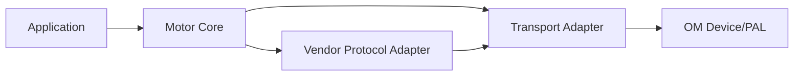

# 电机统一模型顶层设计规范（v1.0）

> 本文用于定义 OM 电机统一模型的顶层设计原则、分层边界、语义合同与工程落地约束。  
> 本文不是 API 参考手册，而是设计方法论与工程门禁文档。  
> 分层总依赖矩阵以 `oh-my-robot/document/architecture/分层与依赖规范.md` 为唯一规范源；本文只定义 motor 专项约束。

## 0. 文档目的与范围

- 将“电机总线”从物理总线概念提升为控制域逻辑单元（`MotorBus`）。
- 建立脱敏于具体 vendor 的统一语义合同，隐藏厂商实现细节。
- 在保留现有 vendor 接口外观的前提下，定义统一模型适配路径。
- 覆盖架构设计必须考虑的完整要素：总线、协议、对象模型、调度、安全、故障、参数、诊断、工程化。

本规范当前范围：

- 物理链路：CAN、CANFD、RS485（通过 OM PAL/Device 接入）
- vendor：DJI、P1010B、达妙
- 交付形态：合同文档 + 适配策略 + 阶段门禁

本规范明确不包含：

- ECAT 接入与其周期同步模型实现
- 轨迹规划、观测器等高级控制算法实现
- 完整在线参数事务重试实现细节

------

## 1. 核心结论（先给结论）

1. `MotorBus` 是控制域逻辑对象，不是 `can1/serial2` 这类物理端口别名。
2. 统一层只暴露语义合同，vendor 协议细节必须封装在适配层。
3. 统一层采用“核心语义 + 能力描述”模型：核心接口稳定，差异能力显式声明。
4. 调度、状态机、安全与故障动作由 Core 主导，vendor 不得接管系统级语义决策。
5. 旧接口族（`dji_*`、`p1010b_*`）当前阶段保留签名，内部映射到统一模型。

------

## 2. 背景与设计目标

## 2.1 背景

- 当前仓库存在多个 vendor 驱动，协议语义差异显著：
  - DJI：组帧 + 槽位模型
  - P1010B：命令矩阵 + 状态守卫模型
  - 达妙：模式驱动 + 寄存器参数模型
- 若继续按 vendor 直接暴露接口，上层业务会持续被协议细节污染。
- 项目已具备 OM 外设抽象层（Serial/CAN），统一模型应复用而非重建底层。

## 2.2 设计目标

1. 语义统一：上层面向统一控制、状态、故障语义编程。
2. 边界清晰：Core、Transport、Vendor Adapter 职责不交叉。
3. 可扩展：在不破坏 Core 合同前提下扩展新 vendor 与新链路。
4. 可诊断：命令拒绝、超时、故障动作、能力缺失均可追踪。
5. 可迁移：旧接口平滑映射，减少业务侧一次性改动风险。

------

## 3. 核心设计原则（必须遵守）

## 3.1 契约优先原则

- **MUST**：先定义语义合同，再实现接口与适配。
- **MUST**：所有实现行为可回链到合同编号（见合同索引）。
- **MUST NOT**：未进入合同编号的行为不得对外承诺稳定性。

## 3.2 逻辑总线优先原则

- **MUST**：按控制域构建 `MotorBus`，一个总线可挂多个物理端口与多个 vendor。
- **MUST NOT**：把物理端口概念直接暴露为上层主语义对象。

## 3.3 差异吸收原则

- **MUST**：vendor 差异首先在适配层吸收。
- **MUST**：不支持能力必须显式返回错误，不得隐式成功。
- **MUST NOT**：业务层出现 vendor 分支处理协议细节。

## 3.4 上下文约束原则

- **MUST**：ISR 仅做最小事件触发，不执行阻塞与重解析。
- **MUST**：协议解析与状态推进在线程上下文执行。
- **MUST**：同一 `MotorBus` 只允许单处理线程推进 `process`。

## 3.5 安全优先原则

- **MUST**：故障与告警语义分离。
- **MUST**：故障动作（WARN/LIMIT/DISABLE/LATCH）由 Core 统一执行。
- **MUST NOT**：vendor 适配器绕过 Core 状态机直接恢复运行。

------

## 4. 分层架构与依赖方向

## 4.1 层职责

- `PAL/Device`：
  - 提供设备句柄、读写、过滤器、回调、时戳
- `Transport Adapter`：
  - 统一收发上下文、端口路由、帧级错误统计
- `Vendor Protocol Adapter`：
  - 协议编解码、单位换算、故障码映射、能力声明
- `Motor Core`：
  - 命令接收、状态机、调度、超时、故障动作、快照聚合
- `Application`：
  - 业务控制策略与监控，不接触 vendor 协议细节

## 4.2 依赖约束

- `Application` 不得依赖 vendor 私有头文件。
- `Motor Core` 不得依赖 vendor 帧格式常量。
- `Vendor Adapter` 不得实现系统级调度策略。
- `Transport Adapter` 不得解释业务语义。

------

## 5. 架构完整考虑清单（必须覆盖）

## 5.1 总线与传输抽象（MM-BUS）

1. 逻辑总线建模与多端口挂载
2. 端口路由绑定与消息归属
3. 收发预算、拥塞与丢弃策略
4. 时间戳统一语义与时钟来源约束

## 5.2 协议适配抽象（MM-PROTO）

1. `encode/decode` 统一入口
2. raw/SI 双语义数据映射
3. vendor 故障码映射与保留原始码
4. 模式差异与命令矩阵差异吸收

## 5.3 电机对象模型（MM-CORE）

1. `MotorNode` 生命周期
2. 命令缓存与快照缓存一致性
3. 状态机转移规则
4. 命令拒绝原因可观测

## 5.4 调度与频率模型（MM-SCH）

1. 控制频率、发送频率、反馈超时分离
2. 总线 flush 周期与预算
3. 多节点异频调度支持

## 5.5 安全与故障模型（MM-SAFE/MM-FLT）

1. 故障闭锁与恢复路径
2. 告警非闭锁通道
3. 命令过期策略（保持/缓降/禁能）
4. 限幅策略（电流/速度/扭矩/位置）

## 5.6 参数与配置模型（MM-PARAM/MM-CFG）

1. 读写权限与状态前置条件
2. 参数持久化语义（save）
3. 默认值与边界校验

## 5.7 诊断与可观测性（MM-DIAG）

1. last snapshot
2. 计数器（timeout/drop/reject/fault）
3. 事件记录（状态变更/故障动作）

## 5.8 工程化约束（MM-ENG）

1. 编译开关可裁剪
2. 静态内存优先
3. 性能预算与回归门禁

------

## 6. 对外接口风格（命令 + 快照）

## 6.1 接口约束

- **MUST**：命令写入与快照读取解耦。
- **MUST**：拒绝原因必须可查询。
- **MUST**：快照包含 `valid_mask + timestamp`。

## 6.2 统一类型命名约束

- 类型名不使用版本号后缀。
- 推荐统一类型：
  - `MotorCommand`
  - `MotorSnapshot`
  - `MotorState`
  - `MotorFaultInfo`
  - `MotorCapabilityProfile`

------

## 7. 兼容与迁移策略

1. 现阶段保留 `dji_*`、`p1010b_*` 接口签名。
2. 通过内部映射层接入统一模型合同。
3. 映射差异必须形成 `compat_note` 并回链合同编号。
4. 禁止新增新的 vendor 直连业务接口。

------

## 8. 当前范围与后续范围

## 8.1 当前范围（本轮）

- CAN/CANFD/RS485 统一模型与适配策略
- 控制/状态/故障/能力声明合同
- 旧接口映射策略与阶段门禁

## 8.2 明确后置（本轮不做）

- ECAT 接入相关设计与实现

------

## 9. 质量门禁（阻断项）

以下任一命中即阻断：

1. 公共类型泄露 vendor 私有字段。
2. 业务层出现 vendor 协议分支。
3. ISR 路径出现阻塞或重解析。
4. 不支持能力被隐式当作成功。
5. 合同文档与实现语义不一致。

------

## 10. 事实来源与关联文档

- `oh-my-robot/lib/drivers/include/drivers/motor/电机驱动模型架构设计.md`
- `oh-my-robot/lib/drivers/include/drivers/motor/doc/电机统一模型语义合同索引.md`
- `oh-my-robot/lib/drivers/include/drivers/motor/doc/电机统一模型与Vendor适配责任边界说明.md`
- `oh-my-robot/lib/drivers/include/drivers/motor/doc/电机统一模型研发规划.md`
- `oh-my-robot/lib/osal/doc/OSAL+SYNC顶层设计指南ForAGENTS.md`
- `oh-my-robot/lib/osal/doc/OSAL与SYNC责任边界说明.md`

------

## 11. 变更记录

- `v1.0`：首次建立统一模型顶层规范，补全完整考虑清单，并明确本轮不纳入 ECAT。

