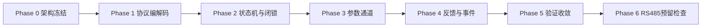

# P1010B 驱动落地计划（CAN 首版）

## 0. 计划摘要

本计划用于指导 P1010B 驱动从架构冻结到联调收敛的实施与验收。

执行原则：
- 首版仅实现 CAN 运行链路。
- 故障闭锁优先。
- 参数采用“全参数框架 + 关键参数白名单”。
- 并发采用“ISR 直解直路由 + 同步事务 completion”。

---

## 1. 里程碑总览

---

## 2. Phase 0 架构冻结

目标：冻结边界、接口、错误模型与状态机约束。

输入：
- `doc/顶层设计指南.md`
- `doc/能力边界说明.md`

任务：
1. 冻结分层依赖规则。
2. 冻结命令矩阵与同步/异步语义。
3. 冻结禁止项与并发边界。

验收门禁：
1. 术语一致。
2. 边界可追溯。

---

## 3. Phase 1 协议编解码

目标：实现 `0x32~0x40` 请求编码与应答分发框架。

任务：
1. 命令组帧。
2. 应答分类路由。
3. 协议常量集中定义。

验收门禁：
1. 每条命令可形成 8 字节载荷。
2. 应答可按 `motorId` 路由到实例。

---

## 4. Phase 2 状态机与故障闭锁

目标：建立统一状态机并固化闭锁策略。

任务：
1. 落地 `Disabled/Enabled/FaultLocked/Configuring`。
2. 落地状态守卫与拒绝原因。
3. 故障码触发闭锁。

验收门禁：
1. 故障后控制给定被拒绝。
2. 未使能给定被拒绝。

---

## 5. Phase 3 参数通道与白名单

目标：建立参数通道与访问控制。

任务：
1. 落地 `write_parameter/read_parameter`。
2. 白名单写入守卫。
3. 失能态写入守卫。
4. 读参事务通知机制（同步返回 + 回调）。
5. 同步事务基础重试（`maxRetryCount`）。

验收门禁：
1. 白名单参数可写可回读。
2. 非白名单写入被拒绝且有明确错误。
3. 读参到达可同步返回结果。

---

## 6. Phase 4 反馈链路与事件回调

目标：建立低延迟反馈更新与应答收敛机制。

任务：
1. 落地 `0x50+id` 反馈更新。
2. 落地 `0xA0+id` 故障状态更新。
3. 落地 `0x60/0x70/0x80/0x90/0xA0/0xB0` 同步应答匹配。
4. 发布四类回调：反馈/故障/在线/读参完成。

验收门禁：
1. ISR 无阻塞。
2. 同步事务应答可在 ISR 内闭环完成并唤醒等待者。

---

## 7. Phase 5 验证与联调收敛

目标：形成可复核验证证据。

测试场景：
1. 单电机控制链路。
2. 故障闭锁链路。
3. 未使能给定拒绝。
4. 参数白名单与读参超时。
5. 在线边沿更新与复位恢复。
6. ISR 高频反馈下最新值覆盖行为。

验收门禁：
1. 关键路径构建通过。
2. 核心场景具备可追溯验证记录。

---

## 8. Phase 6 RS485 扩展预留检查（不实现）

目标：确认后续可扩展而不破坏 CAN 首版语义。

任务：
1. 检查传输层抽象边界。
2. 预留 CRC8-MAXIM 与 11 字节帧接口定义。
3. 形成兼容性评审记录。

---

## 9. 风险台账

1. 规格书差异风险：以规格书优先，使用可配置策略吸收差异。
2. 并发竞争风险：单实例单同步事务，ISR 仅执行无阻塞路径。
3. 事务超时风险：同步事务支持显式超时与结果留痕。

---

## 10. 本轮实施状态（2026-02-21）

已完成：
1. `P1010B.h/.c` CAN 主路径实现并补充注释。
2. scale 缓存落地：注册/设模时更新，发送路径不再分支判断模式。
3. 主动上报配置结构化：`P1010BActiveReportConfig_s`，支持 4 槽类型 ID。
4. `0x34/0x35/0x36/0x37/0x38/0x39` 同步事务统一 completion 实现。
5. ISR 路径完成协议解析、实例路由、状态更新与回调通知。
6. `register` 不再自动开启主动反馈，改为外部显式调用。
7. 样例更新：`oh-my-robot/samples/motor/my_p1010b/main.c`、`oh-my-robot/samples/motor/p1010b/main.c`。

未完成：
1. Phase 5 六类场景的完整联调报告与缺陷闭环记录。
2. 参数级重试退避策略。
3. RS485 运行能力与扩展评审记录。

验证证据：
1. 构建命令：`xmake build robot_project`
2. 结果：构建通过（以当前工程入口为准）。

---

## 11. 变更记录

1. `2026-02-19`：首版 CAN 驱动从空实现落地。
2. `2026-02-20`：读参改为同步等待并补齐完成通知。
3. `2026-02-21`：移除 `p1010b_process`，完成同步/异步协议重构并更新样例流程。
