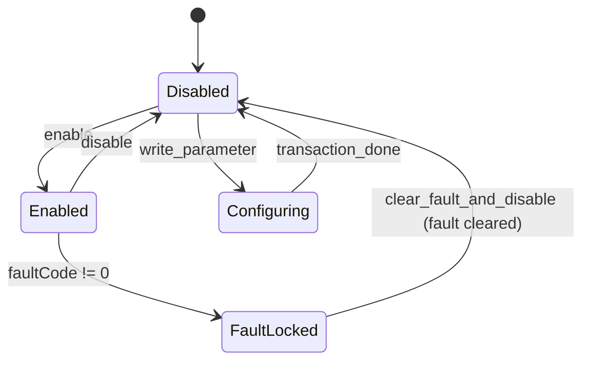

# P1010B 驱动顶层设计指南（CAN 首版）

## 0. 文档目的

定义 P1010B 驱动在 OM 内的顶层设计约束，覆盖：
- 分层边界与依赖方向。
- 协议与状态机语义。
- ISR 并发模型与同步事务模型。
- 扩展与演进约束。

接口细节以 `doc/参考手册.md` 为准。

---

## 1. 设计目标

1. 协议语义稳定：跨 BSP 保持一致行为。
2. 安全优先：故障闭锁优先于控制给定。
3. 可维护：状态与事实单点维护，避免重复状态机。
4. 可扩展：保留 RS485 扩展位但不污染 CAN 首版语义。
5. 可审计：关键约束可映射到代码路径。

---

## 2. 分层架构

分层规则：
- 驱动仅依赖 `Device/CAN` 抽象，不依赖板级寄存器与中断号。
- 应用仅使用驱动 API，不直接拼装协议帧。
- 协议常量在 `P1010B.h` 集中定义，禁止复制魔数。

---

## 3. 协议基线

### 3.1 下行命令

`0x32/0x33/0x34/0x35/0x36/0x37/0x38/0x39/0x40`

### 3.2 上行应答

`0x50+id/0x60+id/0x70+id/0x80+id/0x90+id/0xA0+id/0xB0+id`

### 3.3 同步/异步分类

- 同步事务：`0x34/0x35/0x36/0x37/0x38/0x39`
- 异步命令：`0x32/0x33/0x40`

---

## 4. 对象模型

核心对象：
- `P1010BBus_s`：CAN 绑定、过滤器、`driverTable` 路由索引、分组给定缓存。
- `P1010BDriver_s`：状态机、反馈快照、故障快照、同步事务状态、回调集合。
- `P1010BCommandDescriptor_s[]`：命令描述符表（守卫/编码/匹配/解码/后处理）。

关键设计点：
1. `driverTable[motorId]` 是总线到驱动实例的唯一路由索引。
2. `targetScale` 在注册或设模后缓存，控制路径只做缩放换算。
3. 同步事务采用 completion，单实例同一时刻仅允许一个未决事务。
4. 统一执行器 `__p1010b_execute_request` 负责“守卫 -> 编码 -> 发送 -> 等待 -> 后处理”。
5. 描述符访问采用 O(1) 线性映射：`replyBaseId -> 分发表索引`、`command -> 枚举索引`。

---

## 5. 状态机与守卫

守卫规则：
1. `set_target*`：先判 `FaultLocked`，再判 `Enabled`。
2. `write/save_parameter/set_active_report`：仅 `Disabled`。
3. `set_mode`：复用写参数守卫。
4. 闭锁不可由本地状态机绕开。

---

## 6. 并发模型

ISR 回调内允许：
1. 批量取帧。
2. 按 `motorId` 路由实例。
3. 按应答基地址线性映射分发表执行反馈/故障副作用更新。
4. 基于命令描述符匹配同步应答并 `completion_done`。
5. 触发反馈/故障/读参回调。

ISR 回调内禁止：
- 阻塞等待。
- 动态分配。
- 复杂日志 I/O。

当前不依赖 `p1010b_process` 线程收敛入口。

---

## 7. 参数与主动上报策略

### 7.1 参数写入策略

- 协议层支持全参数读写。
- 业务写入仅开放白名单参数：`11/22/28/42/43/47`。

### 7.2 主动上报策略

`P1010BActiveReportConfig_s`：
- `enable`
- `periodMs`
- `dataTypeSlots[4]`

`dataTypeSlots` 直接下发协议类型 ID，支持附录 1 合法类型。
`register` 只缓存该配置，不自动发送 `0x34`。

---

## 8. 同步事务策略

统一流程：
1. 通过命令描述符解析请求模式（`flags` 或命令默认模式）。
2. 统一执行器执行状态守卫和协议编码。
3. 对同步命令登记 completion 条件并发送 CAN 帧。
4. 等待 completion（支持超时与 `maxRetryCount`）。
5. ISR 按描述符匹配与解码应答，线程侧统一读取 `P1010BResponse_s`。

同步匹配采用最小匹配集：
- 参数类命令匹配 `parameterId`；
- 状态控制匹配 `stateCommand`；
- 其余同步命令仅按命令类型与应答基址完成。

---

## 9. 错误模型

错误层次：
- 参数错误：空指针、非法范围。
- 状态错误：状态守卫不满足。
- 传输错误：CAN 收发失败。
- 事务错误：同步等待超时或并发冲突。

诊断建议：返回码与 `lastRejectReason` 联合解读。

---

## 10. 扩展约束

首版不做：
1. RS485 运行实现。
2. 在线超时离线判定。
3. 参数级重试退避策略。

后续扩展原则：
1. 不破坏现有 CAN API 语义。
2. 不把链路细节泄露到应用层。
3. 扩展后保持同步/异步协议模型一致。

---

## 11. 代码追溯点

- 协议常量与类型：`oh-my-robot/lib/drivers/include/drivers/motor/vendors/direct_drive/P1010B.h`
- 状态机与守卫：`oh-my-robot/lib/drivers/src/motor/vendors/direct_drive/P1010B.c`
- ISR 与事务收敛：`oh-my-robot/lib/drivers/src/motor/vendors/direct_drive/P1010B.c`
- 样例接入：`oh-my-robot/samples/motor/p1010b/main.c`

