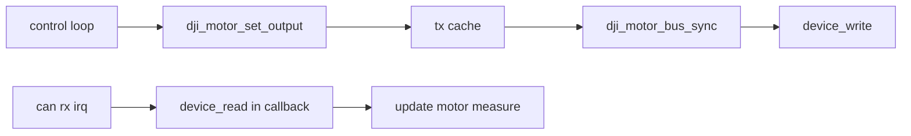

# DJI 电机驱动 API 使用手册

## 1. 适用范围
```text
1. 适用 C610 C620 GM6020 等 DJI 协议电机。
2. 依赖 OM Device 模型与 CAN 抽象层。
3. 发送采用 set output 与 bus sync 分离模型。
```

## 2. 关键变化
旧版需要外部传入 filter bank。  
当前版本改为框架自动分配过滤器资源。

```c
/* 当前接口 */
OmRet_e dji_motor_bus_init(DJIMotorBus_s *bus, Device_t canDev);
```

```text
1. 不再传入 filterBankID。
2. 初始化阶段内部调用 CAN_CMD_FILTER_ALLOC。
3. 返回 filterHandle 并保存于 bus->filterHandle。
```

## 3. 典型使用流程
```c
static DJIMotorBus_s canBus;
static DJIMotorDrv_s motorA;

Device_t canDev = device_find("can1");
device_open(canDev, CAN_O_INT_RX | CAN_O_INT_TX);
device_ctrl(canDev, CAN_CMD_START, NULL);

dji_motor_bus_init(&canBus, canDev);
dji_motor_register(&canBus, &motorA, DJI_MOTOR_TYPE_C620, 1, DJI_CTRL_MODE_CURRENT);

dji_motor_set_output(&motorA, 2000);
dji_motor_bus_sync(&canBus);
```

## 4. 接口说明
### 4.1 `dji_motor_bus_init`
```c
OmRet_e dji_motor_bus_init(DJIMotorBus_s *bus, Device_t canDev);
```

作用：

```text
1. 绑定 CAN 设备。
2. 申请 DJI 接收过滤器并注册回调。
3. 初始化发送组帧链表。
```

### 4.2 `dji_motor_register`
```c
OmRet_e dji_motor_register(
    DJIMotorBus_s *bus,
    DJIMotorDrv_s *motor,
    DJIMotorType_e type,
    uint8_t id,
    DJIMotorCtrlMode_e mode);
```

作用：

```text
1. 建立反馈 ID 到电机对象的 O1 映射。
2. 自动推导控制帧 ID 与槽位索引。
3. 做冲突检测，避免同槽位重复占用。
```

### 4.3 `dji_motor_set_output`
```c
void dji_motor_set_output(DJIMotorDrv_s *motor, int16_t output);
```

作用：

```text
1. 只更新缓存，不直接触发发送。
2. 可在控制循环中高频调用。
```

### 4.4 `dji_motor_bus_sync`
```c
void dji_motor_bus_sync(DJIMotorBus_s *bus);
```

作用：

```text
1. 将脏缓存组包后统一发送。
2. 一次调用可下发多帧控制命令。
```

## 5. 错误处理
常见返回码：

```text
OM_OK
OM_ERROR_PARAM
OM_ERROR_MEMORY
OM_ERR_CONFLICT
```

建议：

```text
1. 初始化与注册都检查返回值。
2. 回调中只做轻量处理，避免阻塞。
3. 若需要释放过滤器，先确保对应消息已消费完毕。
```

## 6. 架构说明


## 7. 迁移清单
```text
1. 删除 dji_motor_bus_init 第三个参数。
2. 删除应用侧固定 bank 配置逻辑。
3. 读取消息时使用 filterHandle，不再使用 bank。
```
