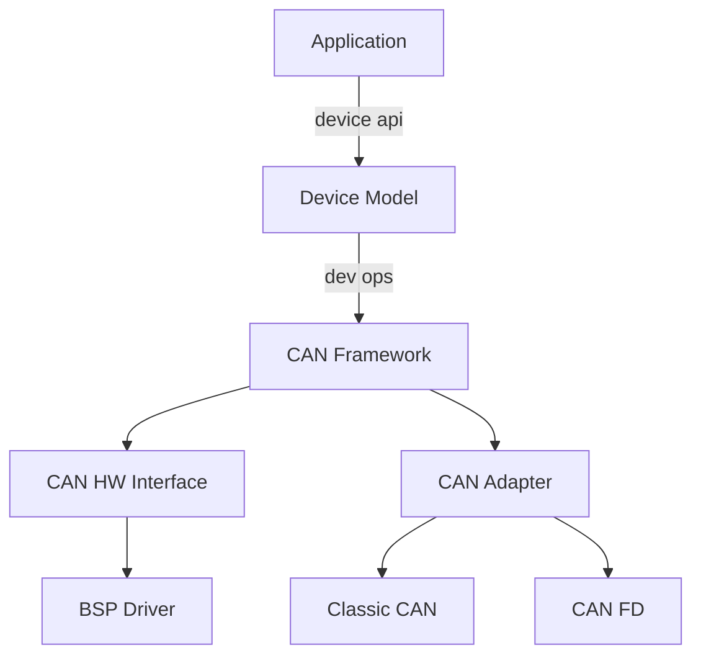
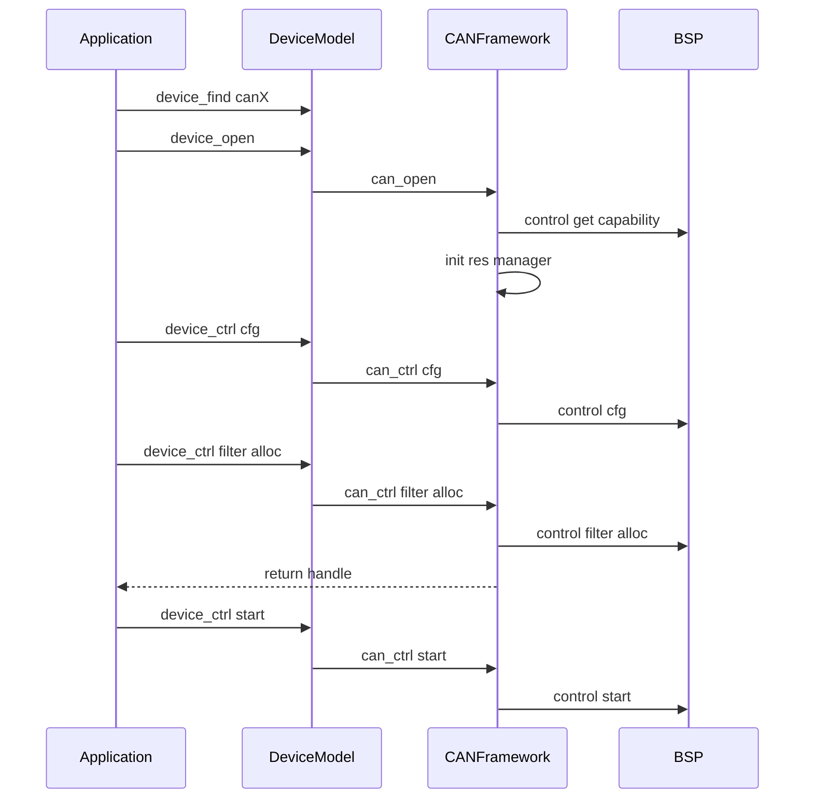
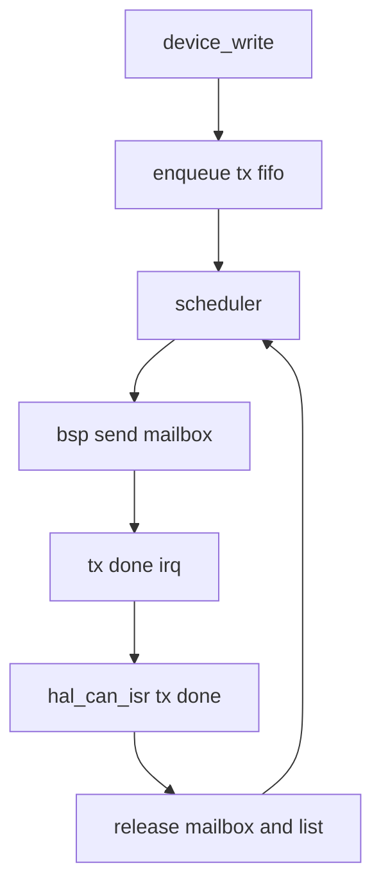
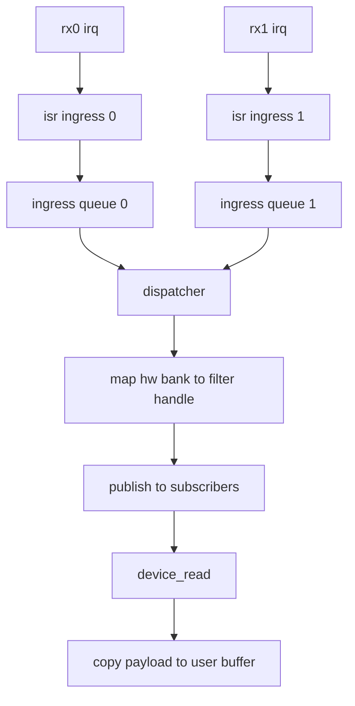
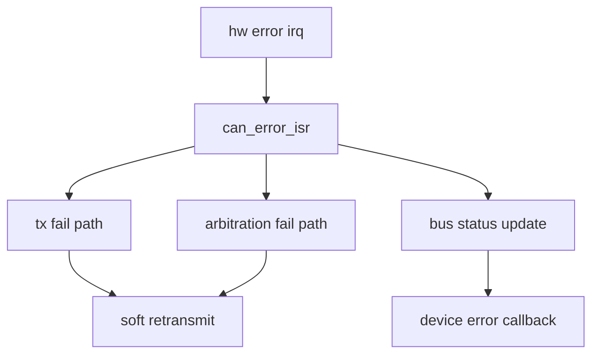
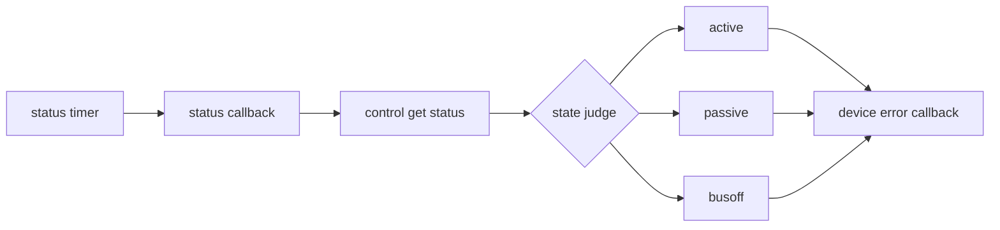

# OM CAN 组织架构说明

> 分层总依赖矩阵以 `oh-my-robot/document/architecture/分层与依赖规范.md` 为唯一规范源，本文仅补充 CAN 专项架构。

## 1. 范围与目标
本文面向架构与集成人员，说明以下内容：

```text
1. BSP 与 CAN 框架与 Device 模型的职责边界。
2. CAN 过滤器资源分配机制。
3. 发送 接收 错误 状态管理的主流程。
4. 接收路径建模与选型结论（详见 can_rx_modeling.md）。
```

说明：

```text
1. 文档保持板级抽象，不绑定具体板卡。
2. 与代码有关的内容均以代码块给出。
```

## 2. 分层架构


关键点：

```text
1. 应用只通过 Device API 使用 CAN。
2. CAN Framework 管理过滤器句柄和软队列。
3. BSP 只暴露硬件能力与收发控制，不暴露板级细节给应用。
```

## 3. 过滤器资源模型


核心语义：

```c
/* 应用可见 */
CanFilterAllocArg_s.request
CanFilterAllocArg_s.handle
CanUserMsg_s.filterHandle

/* 框架内部 */
slotToHwBank[]
slotUsedBits
hwBankUsedBits
```

## 4. 启动时序


## 5. 发送流程


## 6. 接收流程


关键流程片段：

```c
/* ISR 仅做快速入队 */
rx_irq -> ingress_queue[id]

/* dispatcher 统一做路由与发布 */
hwBank -> filterHandle
filterTable[filterHandle].msgCount++
publish_to_subscribers(filterHandle)
```

说明：

```text
1. 框架正确性不依赖 RX0 RX1 是否同优先级。
2. 默认保证同一订阅内 FIFO，不承诺跨订阅全局 FIFO。
3. 详细建模与权衡见 can_rx_modeling.md。
```

## 7. 错误处理流程


## 8. 状态管理流程


## 9. 对外接口收敛说明
```text
1. 业务收发和过滤器操作全部走 device_ctrl device_read device_write。
2. BSP 与 CAN 框架交互通过 hwInterface，不直接暴露给应用。
3. 过滤器硬件 bank 由框架与 BSP 协同分配，应用仅处理 handle。
```

## 10. 审计结论
### 10.1 结论
```text
当前实现符合 BSP + CAN + Device 三层职责划分，应用接口已收敛到 Device 语义。
```

### 10.2 逐项判断
```text
1. 应用是否依赖板级 bank
   结论 通过
   证据 CAN_CMD_FILTER_ALLOC 返回 handle 应用不传 bank

2. 过滤器是否可避免跨模块冲突
   结论 通过
   证据 资源管理器统一分配 slot 与 hw bank

3. BSP 是否保持抽象
   结论 通过
   证据 BSP 只上报 capability 和执行 control

4. 接口是否收敛到 Device
   结论 通过
   证据 业务层只使用 device api
```

### 10.3 主要风险
```text
1. 若 BSP capability 配置错误 会导致过滤器分配失败或错配。
2. 释放过滤器前若存在未消费消息 会返回 busy 需要上层先排空。
3. ISR 与应用并发访问场景依赖框架临界区实现 正确性需长期回归验证。
4. 入口高负载下可能出现队列积压，需要按 can_rx_modeling.md 做监控与降级。
```
