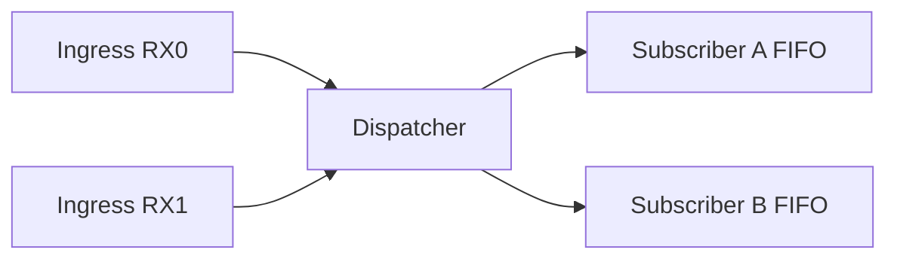
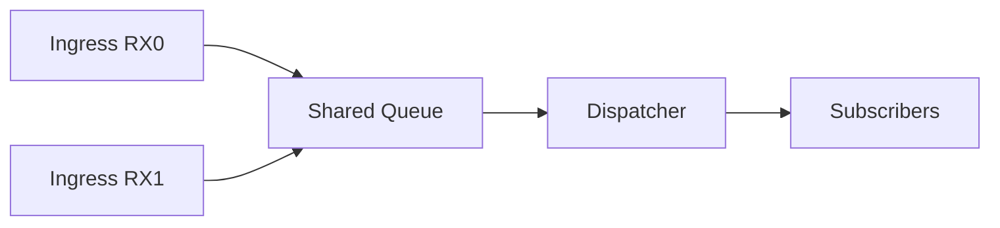
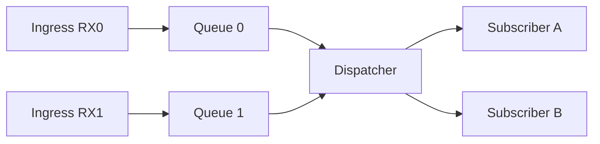

# CAN 接收路径建模与技术选型说明（需求驱动版）

## 1. 文档目的
本文从需求侧出发，给出 CAN 接收路径的建模、方案权衡和结论，用于指导后续实现与审计。

范围：

```text
1. 仅关注接收路径（RX），不覆盖发送路径。
2. 冻结架构结论、约束与验收口径，不冻结具体 API 签名。
3. 适用于 Classic CAN 与 CANFD 的统一接收框架设计。
```

---

## 2. 需求基线

## 2.1 业务需求

```text
B1. 多模块可并发订阅同一类或重叠报文。
B2. 应用层不感知板级中断入口和硬件 filter bank 细节。
B3. 同一订阅内消息顺序可预测（FIFO）。
B4. 系统在高负载下具备可观测降级行为，而不是静默异常。
```

## 2.2 性能需求

```text
P1. ISR 路径必须有界时延，禁止阻塞和动态分配。
P2. 在 1Mbps Classic CAN 与 8Mbps CANFD 负载下，接收路径不成为主瓶颈。
P3. 在突发流量下可量化监控积压、丢包和抖动。
```

## 2.3 适配需求

```text
A1. 框架可适配不同板卡的不同 ingress 数量。
A2. 框架正确性不得依赖 RX0 RX1 同优先级配置。
A3. 板级差异应收敛到 BSP，应用语义不变。
```

---

## 3. 术语与模型统一

```text
Ingress: 中断接收入口（例如 RX0 RX1）
Dispatcher: 接收归并与分发执行点
Subscriber: 订阅者（应用模块）
Per-Subscriber FIFO: 每个订阅者独立消息队列
```

模型约定：

```text
1. 中断入口层优先采用 N 路 SPSC（每路入口一个生产者）。
2. 分发层采用单分发者向多个订阅者扇出（SPMC 语义）。
3. 单共享队列 + 多入口写入属于 MPSC，不视为 SPMC。
```

---

## 4. 需求约束下的顺序语义

顺序边界：

```text
1. 框架必须保证“同一订阅内 FIFO”（满足 B3）。
2. 默认不承诺跨入口和跨订阅的全局 FIFO（避免引入高成本全局排序）。
3. 如需全局顺序，需引入统一排序键（时间戳或单调序号）。
```

顺序语义图：



---

## 5. 候选方案（按需求评估）

## 5.1 方案 A：单队列 MPSC



需求影响：

```text
1. 满足 B1 B2，但在 P1/P3 上风险较高（多生产者争用导致抖动）。
2. 在 A1 上可做，但跨板卡可预测性弱于方案 B。
3. 优势是内存占用低。
```

## 5.2 方案 B：N 路 SPSC + 单分发



需求影响：

```text
1. 最匹配 P1（ISR 写路径无生产者争用，时延更稳定）。
2. 最匹配 A1 A2（ingress 数量可配置，正确性不依赖优先级）。
3. 满足 B1 B2 B3，且观测粒度细（每路 ingress 可独立统计，满足 P3 B4）。
```

## 5.3 方案 C：依赖同优先级的伪单生产者

```text
1. 实现简单，但 A2 不满足。
2. 正确性绑定板级中断配置，迁移风险高。
3. 不作为框架基线。
```

---

## 6. 需求追踪矩阵

```text
需求ID   需求描述                           方案A MPSC   方案B N路SPSC   方案C 伪单生产者
B1      多模块并发订阅                      通过          通过             通过
B2      应用不感知板级入口细节              通过          通过             通过
B3      同订阅 FIFO                         通过          通过             通过
B4      高负载可观测降级                    中            高               低
P1      ISR 有界时延                        中            高               低
P2      1M/8M 负载下稳定                    中            高               低
P3      积压抖动可监控                      中            高               低
A1      入口数量可扩展                      中            高               低
A2      不依赖同优先级                      中            高               不通过
A3      板级差异收敛 BSP                    中            高               低
```

---

## 7. 选型结论

```text
首版采用方案 B：N 路 SPSC + 单 Dispatcher + 每订阅独立 FIFO。
```

结论依据：

```text
1. 业务侧：最稳地支持多订阅并发与顺序语义边界。
2. 性能侧：最符合 ISR 有界时延与高负载可观测目标。
3. 适配侧：不依赖中断优先级假设，适合跨板卡演进。
```

强约束：

```text
MUST:
1. 框架正确性不得依赖 RX0 RX1 同优先级配置。
2. ISR 路径必须无阻塞 无动态分配 O(1) 入队。
3. 应用层仅感知订阅句柄，不感知 ingress 细节。

MUST NOT:
1. 不得把同优先级作为唯一正确性前提。
2. 不得把板级入口模型直接暴露给应用层。
```

---

## 8. 适配策略（需求到实现的映射）

```text
1. BSP 提供 ingressCount 与入口标识集合。
2. 框架按 ingressCount 初始化入口队列。
3. Dispatcher 统一归并并发布到订阅者。
```

概念示例（非冻结 API）：

```c
/* 仅示意，不作为最终接口承诺 */
uint8_t ingressCount;
uint8_t ingressIdList[MAX_INGRESS];
```

---

## 9. 性能预算与观测口径

设计预算：

```text
1. ISR 入队耗时 p99:
   - Classic CAN 1Mbps: <= 8us
   - CANFD 8Mbps: <= 12us

2. Dispatcher 批次处理周期 p99:
   - <= 100us

3. 队列满丢弃率:
   - 稳态 <= 1e-6

4. 端到端接收时延 p99（ISR 到订阅队列可读）:
   - <= 300us
```

观测项：

```text
1. 每路 ingress 队列深度峰值
2. 每路 ingress 丢包计数
3. dispatcher 周期抖动
4. 每订阅者 FIFO backlog
```

---

## 10. 风险与降级策略

```text
1. 高频突发导致 ingress 队列填满。
2. 慢订阅者导致 backlog 积压。
3. 过滤规则过粗导致软件分发负担上升。
```

降级策略：

```text
1. 入口队列扩容并启用按 ingress 独立统计。
2. 慢订阅者限流或丢旧包策略。
3. 收紧硬件过滤范围，降低无效包进入率。
```

---

## 11. 实施里程碑

```text
M0. 建立 1M/8M 基线测量
M1. N 路 ingress 队列抽象落地
M2. dispatcher 与订阅分发落地
M3. 顺序语义与压力测试
M4. 审计收口与文档归档
```

---

## 12. 审计检查清单

```text
1. 是否以需求基线驱动方案选择，而非仅凭实现偏好
2. 是否定义同订阅 FIFO 边界与全局顺序非承诺
3. 是否移除“同优先级即正确”的隐式假设
4. 是否给出量化性能预算和观测口径
5. 是否具备跨板卡 ingress 数量适配能力
6. 是否具备可执行降级策略
```
